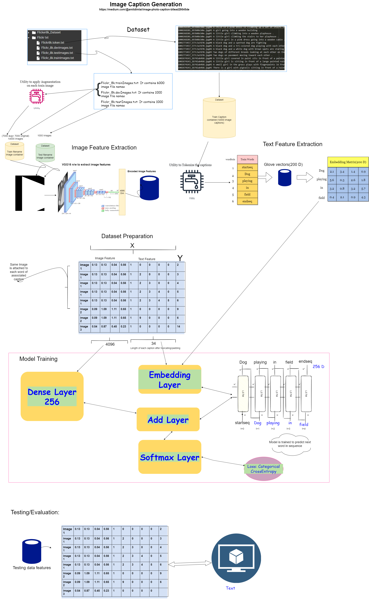

# Image-Caption Generation
Image Caption is one of the exciting and challenging tasks in the world of modern machine learning(Deep Learning).
The task of image caption generation involves outputting a readable and concise description of the contents of an image.

Essentially it requires combining two different domains of artificial intelligence:
Computer vision — To understand the content of the image.
Natural language processing — To turn the understanding of the image into words in the right order.

An image captioning system would encode the image using a pre-trained Convolutional Neural Network(ENCODER) that extract essential features from it.
And then a network model(DECODER) reads the encoded features and generates the textual description output.

Refer to Blog: https://medium.com/@amitdlmlai/image-photo-caption-b0ead29545de
